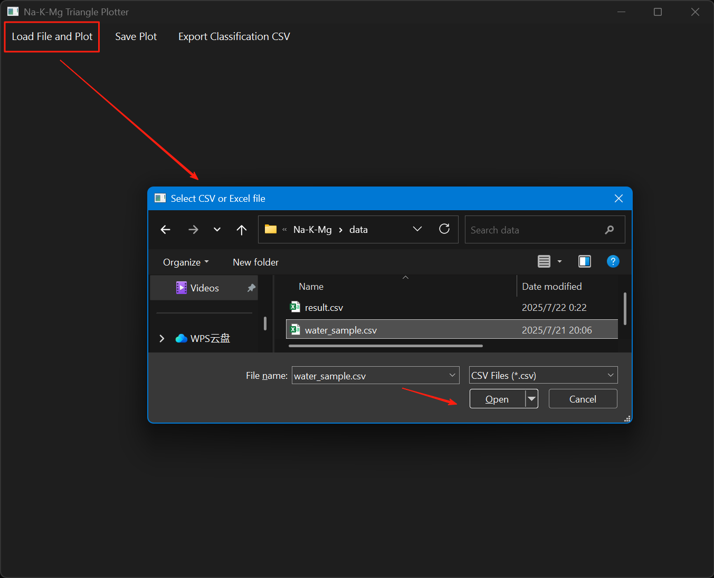
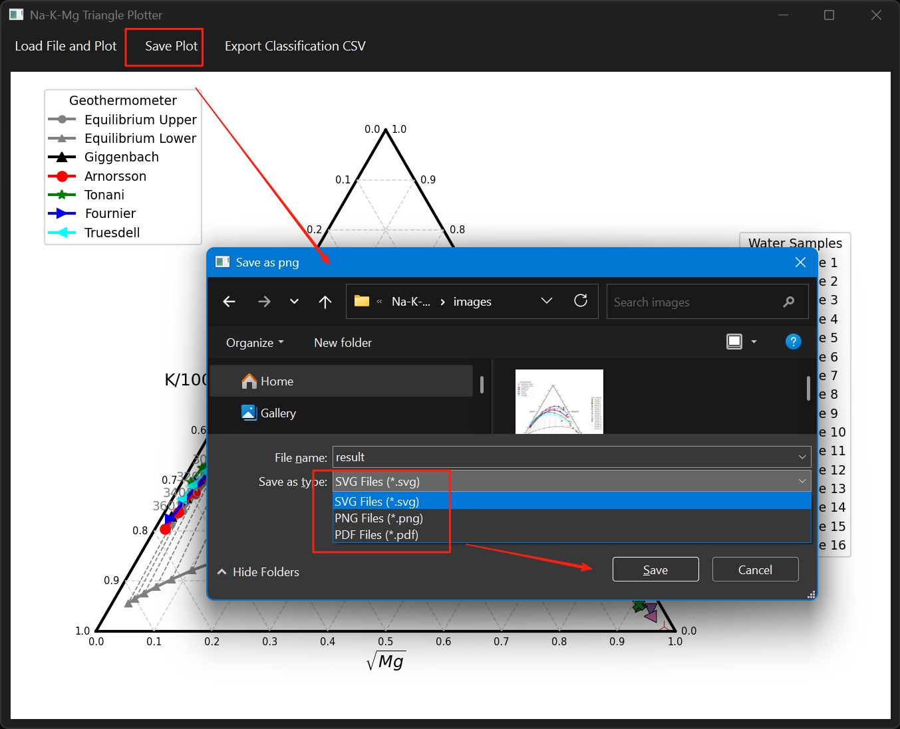

# Na-K-Mg Hydrochemical Analysis Software

Version: 1.0

## Introduction
This professional tool specializes in groundwater hydrochemical type determination. Developed in Python, it implements triangular diagram visualization for Na-K-Mg ion concentration analysis, featuring intelligent water type classification based on industry standards.

## Key Features
1. CSV data parsing & standardization
2. Automatic ion equivalent conversion
3. Dynamic ternary diagram plotting
4. Smart hydrochemical classification
5. PDF report export

## Technical Specifications
- Scientific visualization with matplotlib
- Data processing using pandas
- Cross-platform GUI built with PySide6
- Windows/Linux/macOS compatibility

## System Requirements
- Python 3.11+
- Dependencies: PySide6, matplotlib, pandas, numpy

## Function Overview
- Load water sample data files in CSV or Excel format
- Automatically plot Na-K-Mg ternary diagrams with geothermometers (Giggenbach, Arnorsson, Tonani, Fournier, Truesdell) and equilibrium lines
- Export images in multiple formats (PNG, JPG, SVG, PDF)
- Export classification results as CSV files
- User-friendly graphical interface

## Dependencies
- Python 3.11+
- PySide6
- matplotlib
- pandas
- numpy

Install dependencies with:

```bash
pip install PySide6 matplotlib pandas numpy
```

## Usage
1. Run main program:

```bash
git clone https://github.com/GeoPyTool/Na-K-Mg-plotter.git
cd Na-K-Mg-plotter
python triangle_gui.py
```

2. Select "Load File and Plot" from menu to load water sample data (supports CSV, Excel files)
3. The ternary diagram will be automatically plotted after loading
4. Select image format from menu and click "Save Plot" to export
5. Click "Export Classification CSV" to export sample classification results

## Data Format Requirements
Data files must contain these columns:
- `Na`: Sodium ion concentration
- `K`: Potassium ion concentration
- `Mg`: Magnesium ion concentration
- (Optional) `Station ID`: Sample ID or name

## File Description
- `triangle_gui.py`: Main program and interface logic
- `water_sample.csv`: Sample data file
- `result.png`, `result.svg`: Sample output images
- `result.csv`: Sample classification results

## Screenshots







## Sample Output


## References

- Liu Yang, Zhang Huamei, Li Dongya. Matlab Implementation of Na-K-Mg Ternary Diagram - Case Study of Hainan Island Hot Spring Data[J]. Seismological and Geomagnetic Observation and Research, 2022, 43(5):111-119.
- Giggenbach, W.F. (1988). Geothermal solute equilibria. Derivation of Na-K-Mg-Ca geoindicators. Geochimica et Cosmochimica Acta, 52(12), 2749-2765.
- Arnórsson, S., et al. (1983). The chemistry of geothermal waters in Iceland. III. Chemical geothermometry in geothermal investigations. Geochimica et Cosmochimica Acta, 47(3), 567-577.

## License
This software is licensed under GPLv3. Academic research and commercial use permitted. Open-source compliance required for derivative works. See LICENSE file for details.