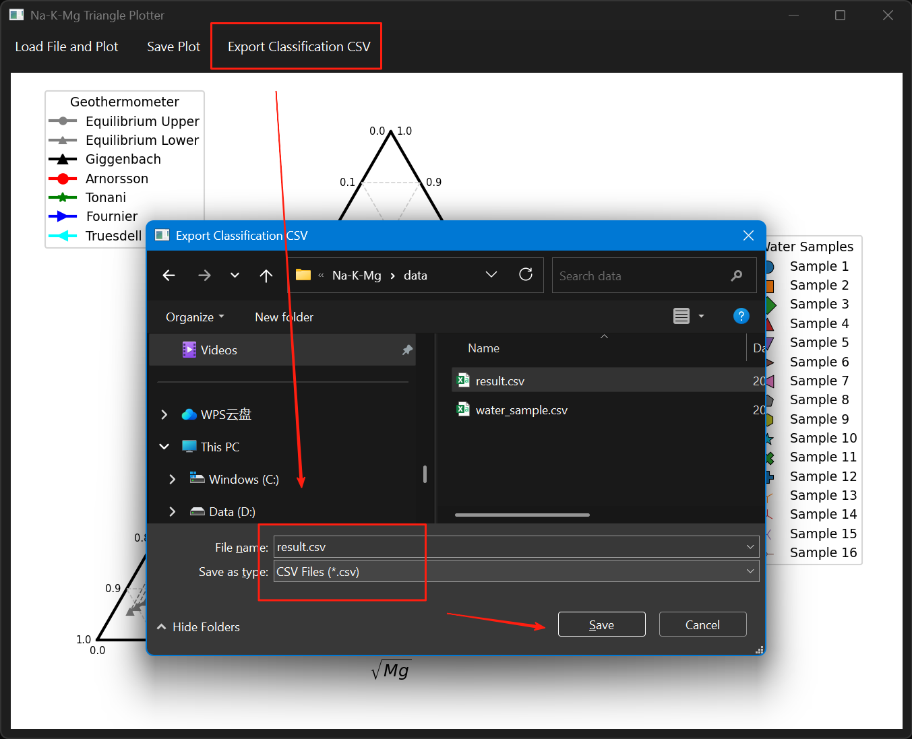

# Na-K-Mg 水化学分析软件

版本号：1.0

## 软件简介
本软件是专门用于地下水化学类型判定的专业工具，基于Python开发，采用三角形图示法实现水样中Na-K-Mg离子浓度的可视化分析。软件可自动计算水样参数，生成三角坐标图，并依据行业标准进行水化学类型智能分类。

## 主要功能
1. CSV数据文件解析与标准化处理
2. 离子当量浓度自动换算
3. 三角坐标系动态绘制
4. 水化学类型智能判定
5. 分析报告PDF导出

## 技术特点
- 基于matplotlib实现科学可视化
- 采用pandas进行数据处理
- 使用PySide6构建跨平台GUI
- 支持Windows/Linux/macOS系统

## 运行环境
- Python 3.11+
- 依赖库：PySide6, matplotlib, pandas, numpy

## 功能简介
- 加载 CSV 或 Excel 格式的水样数据文件
- 自动绘制 Na-K-Mg 三角图，包含地热计曲线（Giggenbach、Arnorsson、Tonani、Fournier、Truesdell）及平衡线
- 支持多种图片格式导出（PNG、JPG、SVG、PDF）
- 支持样品分类结果导出为 CSV 文件
- 图形界面友好，操作简便

## 依赖环境
- Python 3.11+
- PySide6
- matplotlib
- pandas
- numpy

可通过如下命令安装依赖：

```bash
pip install PySide6 matplotlib pandas numpy
```

## 使用方法
1. 运行主程序：

```bash
git clone https://github.com/GeoPyTool/Na-K-Mg-plotter.git
cd Na-K-Mg-plotter
python triangle_gui.py
```

2. 在界面菜单栏选择“Load File and Plot”加载水样数据（支持 CSV、Excel 文件）。
3. 加载后自动绘制三角图。
4. 可通过菜单栏选择图片格式并点击“Save Plot”导出图片。
5. 可点击“Export Classification CSV”导出样品分类结果。

## 数据格式要求
数据文件需包含以下列：
- `Na`：钠离子浓度
- `K`：钾离子浓度
- `Mg`：镁离子浓度
- （可选）`台站编号`：样品编号或名称

## 文件说明
- `triangle_gui.py`：主程序及界面逻辑
- `water_sample.csv`：示例数据文件
- `result.png`、`result.svg` 等：示例输出图片
- `result.csv`：示例样品分类结果

## 运行过程




## 生成图像


## 参考文献

- 刘阳,张华美,李冬雅.Na-K-Mg三角图的Matlab实现——以海南岛温泉(深井)数据分析为例[J].地震地磁观测与研究, 2022, 43(5):111-119.
- Giggenbach, W.F. (1988). Geothermal solute equilibria. Derivation of Na-K-Mg-Ca geoindicators. Geochimica et Cosmochimica Acta, 52(12), 2749-2765.
- Arnórsson, S., et al. (1983). The chemistry of geothermal waters in Iceland. III. Chemical geothermometry in geothermal investigations. Geochimica et Cosmochimica Acta, 47(3), 567-577.

## 许可协议
本软件遵循GPLv3开源协议，允许学术研究及商业应用，二次开发需保持代码开源。详细条款参见LICENSE文件。
