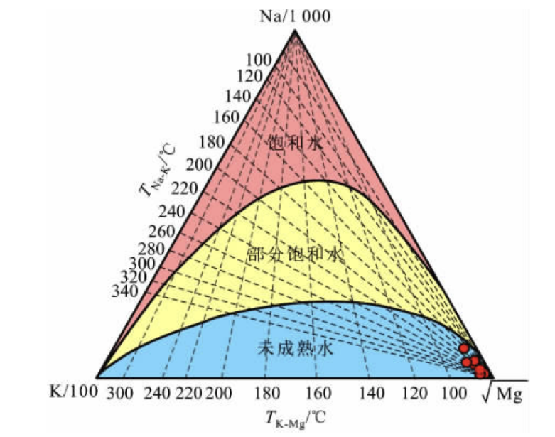

**Na-K-Mg三角图**

Na-K-Mg三角图是由Giggenbach于1988年提出的，以Na/1000、K/100和√Mg为3个顶点，划分为完全平衡、部分平衡和未成熟三种类型的水，常被用来判断水-岩平衡状态和区分水样类型。

理论基础：主要是根据其 1983年发表的Na-K温标公式和略作修改的K-Mg温标公式构筑该图。

**1.三元相图的含义**

{width="3.5524857830271217in"
height="2.7946555118110235in"}

如图：**左腰**：K/100；**右腰**：√Mg；**底边**：Na/1000；**数据点离哪条边最远，就离对应端元越近，含量越高**。

**2. 平衡曲线**

**（1）理论基础：**

| 地热温标 | 公式                                                                                | 参考文献           |
| -------- | ----------------------------------------------------------------------------------- | ------------------ |
| Na-K     | 
$$
T_{1} = \frac{1390}{1.750 + \log\left( \frac{C_{Na}}{C_{K}} \right)} - 273.15
$$

    | (Giggenbach, 1988) |
| K-Mg     | 
$$
T_{2} = \frac{4410}{14.0 + \log\left( \frac{C_{K}^{2}}{C_{Mg}} \right)} - 273.15
$$

 | (Giggenbach, 1988) |

注：C~Na~、C~K~和C~Mg~的单位均为mg/L。

**（2）推导过程**

思路：消去温度T，建立Na、K、Mg三者之间的直接关系

令T~1~=T~2~得：

$$
\frac{1390}{1.750 + \log\left( \frac{C_{Na}}{C_{K}} \right)} = \frac{4410}{14.0 + \log\left( \frac{C_{K}^{2}}{C_{Mg}} \right)}
$$

交叉相乘并化简：

$$
\log\frac{C_{Na}}{C_{K}} = \frac{1390}{4410}\left( 14.0 - \log\frac{C_{K}^{2}}{C_{Mg}} \right) - 1.75
$$

将对数移到左边，合并指数：

$$
\log C_{Na} = \log C_{K} + \frac{1390}{4410}\left( 14.0 - 2\log C_{K} + \log C_{Mg} \right) - 1.75
$$

整理常数项与系数：

$$
\log C_{Na} = \left( 1 - \frac{2 \times 1390}{4410} \right)\log C_{K} + \frac{1390}{4410}\log C_{Mg} + \left( \frac{1390 \times 14}{4410} - 1.75 \right)
$$

对系数进行计算得：

$$
\log C_{Na} = 0.37\log C_{K} + 0.315\log C_{Mg} + 2.66
$$

指数化得：

$$
C_{Na} = 10^{2.66}C_{K}^{0.37}C_{Mg}^{0.15}
$$

$$
C_{Na} = 457C_{K}^{0.37}C_{Mg}^{0.15}
$$

**3.部分平衡曲线**

与完全平衡曲线推导过程相同，仅替换经验常数。Giggenbach在统计大量亚平衡水样后，将457调整为100，以反映反应程度较低的情况：

$$
C_{Na} = 100C_{K}^{0.37}C_{Mg}^{0.15}
$$

**4.曲线绘制过程：**

**思路整理**：把"温度T"当成唯一自变量，让它依次跑遍20--340
℃（20℃一个间隔），每一步都按同一套公式算出Na、K、Mg的相对含量，再把这三个量归一化后投影到三角坐标系，得到一系列(x,
y)点；最后把这些点按温度顺序连成两条光滑弧线------一条用比例常457（完全平衡），一条用100（部分平衡）。

（1）设定温度序列

T = 20, 40, 60, ..., 340 ℃（共17档）

（2）固定比例尺

选C~K~ = 1 mg/L（任何非零常数皆可，因为最后归一化会消掉）

（3）逐温度计算浓度

- C~Mg~ = 1^2^ ÷ 10\^(14.0 − 4410/(T+273.15))
- C~Na~ = 457 × 1\^0.37 × C~Mg~\^0.315
- S = C~Na~/1000 + 1/100 + √C~Mg~
- x = √C~Mg~ / S

y = C~Na~/1000 / S

（4）得到点列

17 个(x, y) 各带一个T标签

（5）连线成弧

- 把17个点按T从低到高平滑连接得到完全平衡线
- 将步骤（2）中的457换成100，重复（3）和（4）得到部分平衡线

（6）图件完成

两条弧线叠加在 Na-K-Mg
三角图上，弧旁标注温度刻度，即可投样品点并判断水-岩平衡状态与估算温度。
